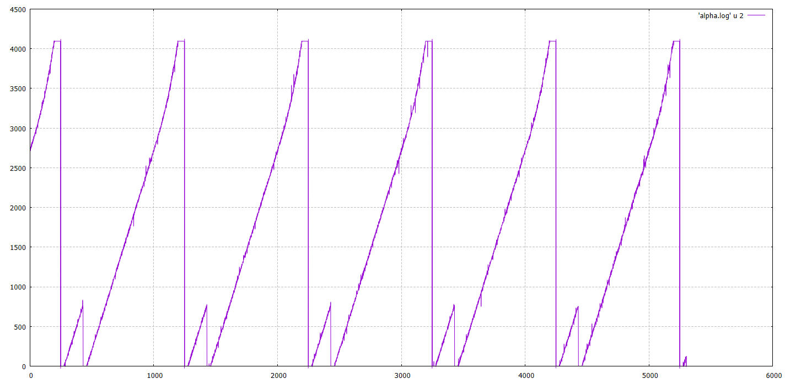

## ESP32 ADC Peripheral Example

This code reads an ADC input of an ESP32 and logs the values.  It works on a
NodeMCU-32s, using ADC6 (GPIO34) for input.  The program expects an input waveform periodic in 20 Hz, each period of which it samples 1000 times.  It uses the falling edge of a square wave input to GPIO23 to trigger sampling.  This way we can connect a function generator ramp output to ADC6 and its sync signal to GPIO23 to get 1000 sample frames at the start of each ramp, as shown here:

## Some detail

I leaned heavily on the ADC example that comes with the ESP-IDF.  The ESP-IDF idiom builds on top of FreeRTOS, which isn't obvious here in the code.  There are two interrupts:  one for the completion of 1000 ADC samples, and one for the sync signal from the function generator.  The latter starts the ADC sampling; the former sets a semaphore which the main loop picks up to output the data.  Note that the sync interrupt only starts a conversion every 20th trigger, so we log only one ramp per second.

## Results

The conversion isn't very linear above 3000 counts.  Also the timing is wrong:

There ought to be one ramp per thousand samples, but we have a big one and a little one, suggesting that the sampling is slow, picking up the start of the next ramp from the function generator.

## References

* [NodeMCU-32S Pinout](https://i0.wp.com/www.teachmemicro.com/wp-content/uploads/2020/06/NodeMCU-32S-Pinout.jpg?ssl=1)
* [ESP32 Technical Reference Manual](https://www.espressif.com/sites/default/files/documentation/esp32_technical_reference_manual_en.pdf)
* [ESP32-WROOM-32 Module Datasheet](https://www.espressif.com/sites/default/files/documentation/esp32-wroom-32_datasheet_en.pdf)
* [ESP32 Series Datasheet](https://www.espressif.com/sites/default/files/documentation/esp32_datasheet_en.pdf)
* [ESP-IDF Programming Guide for ESP32](https://docs.espressif.com/projects/esp-idf/en/latest/esp32/index.html)
